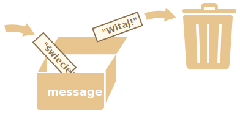

# Zmienne

Przez większość czasu aplikacje javascriptowe muszą działać w oparciu o informacje. Poniżej mamy dwa przykłady:
1. Sklep online -- dane mogą zawierać informacje o sprzedawanych produktach lub koszyku zakupów.
2. Aplikacja do czatu -- dane mogą zawierać użytkowników, wiadomości i wiele więcej.

Zmienne służą do przechowywania tych danych.

## Zmienna

[Zmienna](https://pl.wikipedia.org/wiki/Zmienna_(informatyka)) jest "nazwanym magazynem" dla danych. Możemy użyć zmiennych do przechowywania towarów, danych o odwiedzających i innych.

Aby utworzyć zmienną w JavaScripcie, użyj słowa kluczowego `let`.

Poniższy kod tworzy (lub mówiąc konkretniej: *deklaruje*) zmienną o nazwie "message":

```js
let message;
```

Teraz możemy przypisać do niej jakieś dane używając operatora przypisania `=`:

```js
let message;

*!*
message = 'Witaj'; // przechowaj ciąg znaków
*/!*
```

Ciąg znaków jest teraz zapisany w obszarze pamięci powiązanej ze zmienną. Możemy uzyskać do niego dostęp, używając nazwy zmiennej:

```js run
let message;
message = 'Witaj!';

*!*
alert(message); // wyświetla komunikat z zawartością zmiennej
*/!*
```

Dla zwięzłości, możemy połączyć deklarację zmiennej z przypisaniem danych w jednej linii:

```js run
let message = 'Witaj!'; // zadeklaruj zmienną i przypisz jej wartość

alert(message); // Witaj!
```

Możemy też zadeklarować wiele zmiennych w jednej linii:

```js no-beautify
let user = 'Jan', age = 25, message = 'Witaj';
```

Może wydawać się to bardziej zwięzłe, ale nie polecamy tego podejścia. W trosce o lepszą czytelność kodu, zapisuj każdą zmienną w osobnej linii.

Wielowierszowa wersja jest trochę dłuższa, ale łatwiejsza do przeczytania:

```js
let user = 'Jan';
let age = 25;
let message = 'Witaj';
```

Niektórzy ludzie definiują wiele zmiennych w tym stylu:
```js no-beautify
let user = 'Jan',
  age = 25,
  message = 'Witaj';
```

...Lub nawet w stylu "comma-first" (pol. *najpierw przecinek*):

```js no-beautify
let user = 'Jan'
  , age = 25
  , message = 'Witaj';
```

Wszystkie powyższe przykłady działają tak samo. Wybór zależy od osobistego gustu i poczucia estetyki.

<<<<<<< HEAD

````smart header="`var` zamiast `let`"
W starszych skryptach możesz napotkać słowo kluczowe `var` zamiast `let`:
=======
````smart header="`var` instead of `let`"
In older scripts, you may also find another keyword: `var` instead of `let`:
>>>>>>> f830bc5d9454d85829e011d914f215eb5896579a

```js
*!*var*/!* message = 'Witaj';
```

Słowo kluczowe `var` jest *prawie* tożsame z `let`. Również deklaruje zmienną, lecz w nieco inny, starodawny sposób.

Istnieją subtelne różnice pomiędzy `let` i `var`, ale nie mają one dla nas jeszcze znaczenia na tym etapie nauki. Omówimy je szczegółowo w rozdziale pt. "<info:var>".
````

## Analogia do życia

Możemy łatwo pojąć pojęcie "zmiennej", jeśli wyobrazimy sobie ją jako "pudełko" na dane, z naklejką o unikalnej nazwie.

Na przykład, zmienną `message` możemy wyobrazić sobie jako pudełko z etykietą `"message"` z wartością `"Witaj!"` wewnątrz:


W pudełku możemy umieścić jakąkolwiek wartość.

Możemy też zmienić tę wartość tyle razy, ile chcemy:
```js run
let message;

message = 'Witaj!';

message = 'świecie!'; // wartość zmieniona

alert(message);
```

Kiedy wartość zostaje zmieniona, stare dane są usuwane ze zmiennej:



Możemy też zadeklarować dwie zmienne i skopiować dane z jednej do drugiej.

```js run
let hello = 'Witaj, świecie!';

let message;

*!*
// skopiuj "Witaj świecie!" z 'hello' do 'message'
message = hello;
*/!*

// teraz obydwie zmienne przechowują te same dane
alert(hello); // Witaj, świecie!
alert(message); // Witaj, świecie!
```

<<<<<<< HEAD
```smart header="Języki funkcyjne"
Warto zauważyć, że istnieją języki programowania [funkcyjnego](https://pl.wikipedia.org/wiki/Programowanie_funkcyjne), jak [Scala](http://www.scala-lang.org/) czy [Erlang](http://www.erlang.org/), które zabraniają zmiany wartości zmiennych.
W takich językach, gdy wartość  trafi do "pudełka", pozostaje tam na zawsze. Jeśli chcemy przechować coś innego, język zmusza nas do utworzenia nowego pudełka (zadeklarowania nowej zmiennej). Nie możemy ponownie użyć starego.
=======
````warn header="Declaring twice triggers an error"
A variable should be declared only once.

A repeated declaration of the same variable is an error:

```js run
let message = "This";

// repeated 'let' leads to an error
let message = "That"; // SyntaxError: 'message' has already been declared
```
So, we should declare a variable once and then refer to it without `let`.
````

```smart header="Functional languages"
It's interesting to note that there exist [functional](https://en.wikipedia.org/wiki/Functional_programming) programming languages, like [Scala](http://www.scala-lang.org/) or [Erlang](http://www.erlang.org/) that forbid changing variable values.
>>>>>>> f830bc5d9454d85829e011d914f215eb5896579a

Choć na pierwszy rzut oka może się to wydawać trochę dziwne, te języki całkiem dobrze nadają się do pisania poważnych programów. Co więcej, istnieją obszary, takie jak obliczenia równoległe, w których takie ograniczenie daje pewne korzyści. Warto przestudiować tego typu języki (nawet jeśli nie planujesz go używać w najbliższym czasie), aby poszerzyć horyzonty.
```

## Nazywanie zmiennych [#variable-naming]

Istnieją dwa ograniczenia dla nazw zmiennych w JavaScripcie:

1. Nazwa może zawierać tylko liczby, cyfry lub symbole `$` oraz `_`.
2. Pierwszy znak nie może być cyfrą.

Przykłady poprawnych nazw:

```js
let userName;
let test123;
```

Kiedy nazwa zawiera wiele wyrazów, zwykle stosuje się konwencję [camelCase](https://pl.wikipedia.org/wiki/CamelCase). To jest: słowa następują jedno po drugim, a każde kolejne słowo poza pierwszym zaczyna się od wielkiej litery: `myVeryLongName`.

Co ciekawe - w nazwach można również używać znaku dolara `'$'` i podkreślenia `'_'`. Są to zwykłe symbole, podobnie jak litery, bez specjalnego znaczenia.

Te nazwy są poprawne:

```js run untrusted
let $ = 1; // deklaruje zmienną o nazwie "$"
let _ = 2; // a to zmienną o nazwie "_"

alert($ + _); // 3
```

A te są niepoprawne:

```js no-beautify
let 1a; // nie może zaczynać się od cyfry

let my-name; // myślniki '-' nie są dozwolone
```

```smart header="Wielkość liter ma znaczenie"
Zmienne nazwane `apple` i `AppLE` są dwiema różnymi zmiennymi.
```

````smart header="Litery inne niż łacińskie są dozwolone, ale nie zalecane"
Możliwe jest użycie dowolnego języka, w tym cyrylicy lub nawet hieroglifów:

```js
let имя = '...';
let 我 = '...';
```

<<<<<<< HEAD
Technicznie rzecz biorąc, nie ma tu błędu (takie nazwy są dozwolone), ale istnieje międzynarodowa tradycja używania języka angielskiego do nazywania zmiennych.
Nawet jeśli piszemy niewielki skrypt, może mieć on przed sobą długie życie. Mogą go kiedyś chcieć przeczytać ludzie z innych krajów.
=======
Technically, there is no error here. Such names are allowed, but there is an international convention to use English in variable names. Even if we're writing a small script, it may have a long life ahead. People from other countries may need to read it some time.
>>>>>>> f830bc5d9454d85829e011d914f215eb5896579a
````

````warn header="Nazwy zarezerwowane"
Istnieje [lista słów zarezerwowanych](https://developer.mozilla.org/en-US/docs/Web/JavaScript/Reference/Lexical_grammar#Keywords), które nie mogą być użyte jako nazwy zmiennych, ponieważ używa ich sam język.

Dla przykładu: `let`, `class`, `return` i `function` są zarezerwowane.

Poniższy kod zwraca błąd składniowy (ang. *syntax error*):

```js run no-beautify
let let = 5; // nie można nazwać zmiennej "let", błąd!
let return = 5; // również nie możemy nazwać jej "return", błąd!
```
````

````warn header="Przypisanie bez instrukcji `use strict`"

Zwykle musimy zdefiniować zmienną przed jej użyciem. Ale w dawnych czasach w zasadzie możliwe było stworzenie zmiennej przez zwykłe przypisanie wartości, bez użycia `let`. Nadal to działa, jeśli nie użyjemy `use strict` w naszych skryptach w celu zachowania zgodności ze starymi skryptami.

```js run no-strict
// uwaga: brak "use strict" w tym przykładzie

num = 5; // zmienna "num" zostaje utworzona, jeśli wcześniej nie istniała

alert(num); // 5
```

Jest to zła praktyka i spowodowałaby błąd w trybie rygorystycznym:

```js
"use strict";

*!*
num = 5; // błąd: zmienna 'num' nie jest zdefiniowana
*/!*
```
````

## Stałe

Aby zadeklarować stałą (niezmienną) wartość, użyj `const` zamiast `let`:

```js
const myBirthday = '18.04.1982';
```

Zmienne zadeklarowane przy użyciu `const` są nazywane "stałymi". Nie można ich nadpisać. Próba zrobienia tego spowodowałaby błąd:

```js run
const myBirthday = '18.04.1982';

myBirthday = '01.01.2001'; // błąd, nie można ponownie przypisać wartości do stałej!
```

Gdy programista jest pewien, że zmienna nigdy się nie zmieni, może zadeklarować ją za pomocą `const`, aby to zagwarantować i wyraźnie przekazać ten fakt wszystkim.


### Stałe pisane wielkimi literami

Istnieje powszechna praktyka używania stałych jako aliasów dla trudnych do zapamiętania wartości, znanych przed wykonaniem programu.

Takie stałe są zapisywane za pomocą wielkich liter i podkreślników.

Dla przykładu utwórzmy stałe dla kolorów w formacie szesnastkowym:

```js run
const COLOR_RED = "#F00";
const COLOR_GREEN = "#0F0";
const COLOR_BLUE = "#00F";
const COLOR_ORANGE = "#FF7F00";

// ...gdy potrzebujemy wybrać kolor:
let color = COLOR_ORANGE;
alert(color); // #FF7F00
```

Zalety:

- `COLOR_ORANGE` jest znacznie łatwiejsze do zapamiętania niż `"#FF7F00"`.
- Jest dużo łatwiej źle napisać `"#FF7F00"` niż `COLOR_ORANGE`.
- Podczas czytania kodu, napis `COLOR_ORANGE` niesie z sobą więcej informacji niż `#FF7F00`.

Kiedy powinniśmy używać wielkich liter dla stałej i kiedy powinniśmy nazywać ją normalnie? Wyjaśnijmy to.

Bycie "stałą" oznacza po prostu, że jej wartość nigdy się nie zmienia. Istnieją jednak stałe znane przed wykonaniem (jak wartość szesnastkowa dla koloru czerwonego) i istnieją stałe, które *są obliczane* na bieżąco w czasie wykonywania, ale nie zmieniają się po ich początkowym przypisaniu.

Na przykład:
```js
const pageLoadTime = /* czas, jaki zajął stronie na wczytanie się */;
```

Wartość `pageLoadTime` nie jest znana przed załadowaniem strony, więc jest nazwana normalnie. Ale wciąż jest stała, ponieważ nie zmienia się po przypisaniu.

Innymi słowy, stałe pisane wielkimi literami są używane tylko jako aliasy dla wartości ustawionych na sztywno.

## Nazywaj rzeczy poprawnie

W temacie zmiennych jest jeszcze jedna, bardzo istotna kwestia.

Nazwa zmiennej powinna mieć oczywiste znaczenie i opisywać dane, które przechowuje.

Nazewnictwo zmiennych jest jedną z najważniejszych i najbardziej złożonych umiejętności programowania. Szybkie spojrzenie na nazwy zmiennych może ujawnić, który kod został napisany przez początkującego, a który przez doświadczonego programistę.

W prawdziwym projekcie większość czasu spędza się na modyfikowaniu i rozszerzaniu istniejącego kodu, zamiast pisać coś całkowicie od zera. Kiedy wracamy do jakiegoś kodu po robieniu czegoś innego przez jakiś czas, znacznie łatwiej jest znaleźć informacje, które są dobrze oznaczone. Lub, innymi słowy, gdy zmienne mają dobre nazwy.

Poświęć trochę czasu na zastanowienie się nad właściwą nazwę zmiennej przed jej zadeklarowaniem. Takie podejście odpłaci się z nawiązką.

Niektóre z zasad wartych naśladowania to:

- Używaj czytelnych dla człowieka nazw, jak `userName` lub `shoppingCart`.
- Trzymaj się z dala od skrótów lub krótkich nazw jak `a`, `b`, `c`, chyba że naprawdę wiesz, co robisz.
- Twórz nazwy maksymalnie opisowe i zwięzłe. Przykłady złych nazw to `data` i `value`. Takie nazwy nic nie mówią. Można z nich korzystać tylko wtedy, gdy kontekst kodu czyni wyjątkowo oczywistym, co kryje się w tej zmiennej.
- Ustal nazewnictwo ze swoim zespołem. Jeśli odwiedzający stronę jest nazywany "user", to kolejne, powiązane z nim zmienne powinny nazywać się `currentUser` lub `newUser`, a nie `currentVisitor` lub `newManInTown`.

Brzmi prosto? Z pewnością. Ale tworzenie opisowych i zwięzłych nazw w praktyce nie jest proste. Śmiało, spróbuj!

```smart header="Ponowne użycie czy stworzenie nowej?"
I ostatnia uwaga. Istnieje kilka leniwych programistów, którzy zamiast deklarować nowe zmienne, mają tendencję do ponownego używania istniejących.

W rezultacie ich zmienne są jak pudełka, w które ludzie rzucają różne rzeczy bez zmiany etykiety. Co jest teraz w pudełku? Kto wie? Musimy podejść bliżej i sprawdzić.

Tacy programiści oszczędzają trochę czasu na deklaracji zmiennych, ale tracą dziesięć razy więcej podczas debugowania.

Dodatkowa zmienna jest dobra, nie zła.

Współczesne przeglądarki i minifikacja kodu optymalizują go wystarczająco, więc nie spowoduje to problemów z wydajnością. Używanie różnych zmiennych dla różnych wartości może nawet wspomóc silnik w optymalizacji twojego kodu.
```

## Podsumowanie

Możemy zadeklarować zmienne do przechowywania danych za pomocą słów kluczowych `var`, `let`, lub `const`.

- `let` -- jest współczesną deklaracją zmiennej.
- `var` -- jest starodawną metodą deklaracji zmiennej. Zazwyczaj nie używamy jej wcale, ale omówimy subtelne różnice w odniesieniu do `let` w rozdziale pt. "<info:var>" - na wypadek gdyby była ci potrzebna.
- `const` -- jest jak `let`, ale jej wartość nie może być zmieniana.

Zmienne powinny być nazywane w sposób, który pozwala nam łatwo zrozumieć, co w nich jest.
