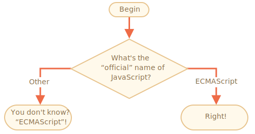

importance: 2

---

# Nazwa JavaScript

Używając instrukcji `if..else`, napisz kod który będzie pytał: 'Jaka jest "oficjalna" nazwa JavaScript?'

Jeżeli odwiedzający wpisze "ECMAScript", wtedy 
If the visitor enters "ECMAScript", then zwróć wynik "Racja!", w przeciwnym wypadku -- zwróć wynik: "Nie wiedziałeś? ECMAScript!"

[demo src="ifelse_task2"]
