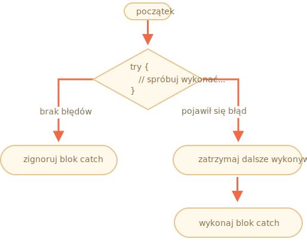

# Obsługa błędów, "try...catch"

Nieważne jak świetnymi jesteśmy programistami, zdarza się, że do naszych programów wkradają się błędy. Mogą wystąpić jako rezultat literówki, przez niespodziewane dane wejściowe użytkownika, błędnej odpowiedzi serwera czy z tysiąca wielu innych powodów. 

Z reguły, nasz program zostaje natychmiastowo przerwany w sytuacji napotkania błędu, zaraz po zwróceniu jego zawartości do konsoli.

Przy użyciu instrukcji `try...catch`, możemy obsłużyć błędy w bardziej sensowny sposób.

## Składnia "try...catch"

Instrukcja `try...catch` zawiera dwa główne bloki, `try {...}` oraz `catch(err) {...}`:

```js
try {

  // instrukcje do wykonania...

} catch (err) {

  // obsługa błędów z pierwszego bloku...

}
```

Sposób działania:

1. Rozpoczęcie wykonywania się kodu zawartego w bloku `try {...}`.
2. Bezbłędne wykonanie pierwszego bloku oznacza, że drugi blok `catch(err) {...}` zostaje pominięty, a program rusza dalej.
3. W przypadku pojawienia się błędu, wykonywanie bloku `try {...}` zostaje przerwane, a kontrola przekazana jest drugiemu blokowi `catch(err) {...}`. Parametr `err` może mieć dowolną nazwę, argumentem jest obiekt zawierający błąd oraz szczegóły jego wystąpienia.



Błąd, który wystąpił w pierwszym bloku `try {...}`, nie przerywa działania programu, więc mamy szansę go obsłużyć w drugim bloku `catch(err) {...}`.

Spójrzmy na przykłady:

- Przykład programu niezawierającego błędu. Wykonuje instrukcje `alert` `(1)` oraz `(2)`:

    ```js run
    try {

      alert('początek bloku try');  // *!*(1) <--*/!*

      // ...instrukcja została wykonana, brak błędu

      alert('koniec bloku try');   // *!*(2) <--*/!*

    } catch(err) {

      alert('blok catch został pominięty, z powodu braku błędu'); // (3)

    }
    ```
- Przykład programu zawierającego błąd. Wykonuje instrukcje `(1)` oraz `(3)`:

    ```js run
    try {

      alert('instrukcja została wykonana');  // *!*(1) <--*/!*

    *!*
      lalala; // niezadeklarowana zmienna powoduje wystąpienie błędu
    */!*

      alert('instrukcja nie została wykonana');  // (2)

    } catch(err) {

      alert(`w programie pojawił się błąd!`); // *!*(3) <--*/!*

    }
    ```

````warn header="`try...catch` umożliwia obsługę błędów napotkanych tylko w trakcie wykonywania się programu (ang. Runtime Errors)"

Aby instrukcja `try...catch` zadziałała, kod zawarty w tym bloku powinien być w stanie się uruchomić. Innymi słowy, musi to być poprawny kod JavaScript. 

Wykonywanie instrukcji zostnanie przerwane, jeśli napotka błąd składni (ang. Syntax Error). Weźmy za przykład nieparzystą ilość klamer:

```js run
try {
  {{{{{{{{{{{{
} catch(err) {
  alert("silnik nie jest w stanie zrozumieć kodu zawartego w powyższym bloku, ponieważ jest niepoprawny");
}
```
Silnik JavaScript najpierw odczytuje kod, a dopiero potem go wykonuje. Błędy podczas fazy analizy kodu nie mogą zostać obsłużone w pierwszym bloku instrukcji, ponieważ niepoprawnie komunikujemy się z silnikiem.

A więc, `try...catch` umożliwia nam tylko i wyłącznie obsługę błędów występujących w poprawnym składniowo kodzie. Nazywane są błędami napotkanymi w trakcie wykonywania się programu, a czasami wyjątkami.
````


````warn header="`try...catch` działa synchronicznie"
Jeśli wyjątek pojawi się w operacji asynchronicznej, przykładowo `setTimeout`, wtedy instrukcja `try...catch` jej nie obsłuży:

```js run
try {
  setTimeout(function() {
    noSuchVariable; // W tym miejscu, program zostanie przerwany
  }, 1000);
} catch (err) {
  alert( "instrukcja nie została wykonana" );
}
```

To dlatego, że nasza anonimowa funkcja została wykonana później, kiedy interpreter zdążył już opuścić instrukcję `try...catch`.  

Aby złapać wyjątek podczas asynchronicznej operacji, `try...catch` musi znajdować się w środku tego działania:
```js run
setTimeout(function() {
  try {    
    noSuchVariable; // instrukcja try...catch obsłuży ten błąd!
  } catch {
    alert( "błąd pierwszego bloku zostanie tutaj obsłużony" );
  }
}, 1000);
```
````

## Obiekt błędu

Podczas pojawienia się błędu w programie, silnik JavaScript generuje obiekt zawierający błąd oraz szczegóły jego wystąpienia. Następnie zostaje przekazany jako argument drugiego bloku `catch(err) {...}`:

```js
try {
  // ...
} catch(err) { // <-- w tym miejscu znajduje się nasz obiekt błędu, parametr err może mieć dowolną nazwę
  // ...
}
```

Dla wszystkich błędów środowiskowych, obiekt błędu składa się z dwóch głównych własności:

`name`
: Identyfikator błędu. Przykład, niezadeklarowana zmienna spowoduje wystąpienie błędu odniesienia (ang. Reference Error).

`message`
: Wiadomość w formie łańcucha znaków, mieszcząca w sobie szczegóły wystąpienia błędu.

Istnieją również nieustandaryzowane własności, które są dostępne w wielu środowiskach. Najbardziej wspieraną i używaną jest właśnie stos:

`stack`
: Aktualny stos wywołań. Zwraca sekwencję zagnieżdżonych wywołań, które doprowadzą nas do miejsca wystąpienia błędu. Przydatne w procesie debugowania.

Przykład:

```js run untrusted
try {
*!*
  lalala; // niezadeklarowana zmienna powoduje wystąpienie błędu
*/!*
} catch(err) {
  alert(err.name); // ReferenceError
  alert(err.message); // lalala is not defined
  alert(err.stack); // ReferenceError: lalala is not defined at (...zagnieżdżona sekwencja wywołań)

  // możemy wyświetlić skondensowaną wersję błędu
  // zwraca wiadomość w formacie "name: message"
  alert(err); // ReferenceError: lalala is not defined
}
```

## Opcjonalne przechwycenie błędu

[recent browser=new]

Jeśli nie potrzebujemy informacji o błędzie, pozbywamy się parametru drugiego bloku `catch(err) {...}`: 

```js
try {
  // ...
} catch { // <-- nie uwzględniamy parametru (err)
  // ...
}
```

## Zastosowanie "try...catch" w życiu codziennym

Spójrzmy na realny sposób użycia instrukcji `try...catch`.

Na tym etapie powinniśmy już wiedzieć o metodzie [JSON.parse(str)](mdn:js/JSON/parse), która umożliwia nam przetworzenie obiektu JSON.

Metoda zwykle jest używana do przekształcenia informacji otrzymanych z poziomu sieci, serwera czy innych źródeł.  

Po ich otrzymaniu, wywołujemy metodę `JSON.parse`:

```js run
let json = '{"name":"Jacek", "age": 30}'; // otrzymane dane z serwera w formie obiektu JSON

*!*
let user = JSON.parse(json); // przekształcamy ciąg znaków na obiekt JavaScript
*/!*

// od teraz pod zmienną "user" znajduje się odniesienie do utworzonego obiektu
alert( user.name ); // Jacek
alert( user.age );  // 30
```

Więcej informacji o obiekcie JSON znajduje się w rozdziale <info:json>.

**Jeśli obiekt JSON został źle sformułowany, metoda `JSON.parse` wygeneruje błąd, który natychmiastowo przerwie program.**

Nie brzmi to przekonująco, prawda?

Jeśli coś pójdzie nie tak, odwiedzający nie otrzyma żadnej informacji zwrotnej o błędzie, który wystąpił. Zazwyczaj nie lubimy, gdy coś nagle przestaje działać i nie wiemy po której stronie leży problem.

Możemy wdrożyć instrukcję `try...catch`, aby obsłużyć ten błąd:

```js run
let json = "{ niepoprawnie sformułowany obiekt JSON }";

try {

*!*
  let user = JSON.parse(json); // <-- instrukcja tworzy obiekt błędu
*/!*
  alert( user.name ); // instrukcja nie została wykonana

} catch(err) {
*!*
  // kontrolę nad programem przejął drugi blok
  alert( "Przepraszamy, wystąpił błąd podczas wykonywania działań na otrzymanych danych z serwera. Spróbujemy wykonać akcję ponownie." );
  alert( err.name );
  alert( err.message );
*/!*
}
```

Drugi blok `catch(err) {...}` zwróci odwiedzającemu wyłącznie wiadomość tekstową oraz szczegóły wystąpienia błędu. Możemy pójść o krok dalej i wykonać kolejne żądanie serwerowe czy zapisać kopię wystąpienia błędu na naszych zasobach serwerowych. Generalnie każdy z tych wariantów jest lepszym rozwiązaniem niż brak implementacji obsługi błędu. 

## Zwracanie własnych wyjątków

Co jeśli odbierany obiekt `json` jest poprawnie sformułowany, ale nie zawiera własności `name`, której się spodziewaliśmy?

Spójrzmy:

```js run
let json = '{ "age": 30 }'; // obiekt JSON nie zawiera własności, którą chcemy zwrócić

try {

  let user = JSON.parse(json); // <-- instrukcja została wykonana, brak błędu
*!*
  alert( user.name ); // metoda alert zwraca wartość undefined, ponieważ własność nie istnieje
*/!*

} catch (err) {
  alert( "instrukcja nie została wykonana" );
}
```

Metoda `JSON.parse` wykonała się poprawnie. Brak spodziewanej własności `name` stanowi dla nas problem. 

Aby poradzić sobie w takich sytuacjach, mamy do dyspozycji operator `throw`.

### Operator "throw"

Za pomocą operatora `throw`, możemy wygenerować obiekt błędu.

Składnia wygląda następująco:

```js
throw <obiekt błędu>
```

Formalnie rzecz biorąc, naszym obiektem błędu może być wszystko. Możemy użyć wartości prymitywnych takich jak ciąg znaków czy wartości numerycznych, ale przyjmujemy konwencję używania obiektów, domyślnie z dwiema własnościami `name` oraz `message`. Głównie ze względu na to, aby zachować analogię zwracania błędów środowiskowych.

Silnik JavaScript oferuje wiele konstruktorów dla błędów środowiskowych: `Error`, `SyntaxError`, `ReferenceError`, `TypeError` i tak dalej. Jeśli chcemy, możemy ich także użyć do utworzenia obiektu błędu.

Zerknijmy na składnię:

```js
let error = new Error(message);
// lub
let error = new SyntaxError(message);
let error = new ReferenceError(message);
// ...
```

Podczas tworzenia błędów środowiskowych, własność `name` przyjmuje wartość nazwy konstruktora, natomiast wartość własności `message` zostaje przekazana jako argument.

Dla przykładu:

```js run
let error = new Error("coś poszło nie tak");

alert(error.name); // Error
alert(error.message); // coś poszło nie tak
```

Spójrzmy jaki błąd wygeneruje wywołanie metody `JSON.parse` na błędnym obiekcie JSON:

```js run
try {
  JSON.parse("{ niepoprawnie sformułowany obiekt JSON }");
} catch(err) {
*!*
  alert(e.name); // SyntaxError
*/!*
  alert(e.message); // Unexpected token b in JSON at position 2
}
```

Jak możemy zauważyć, identyfikatorem błędu jest `SyntaxError`.

W naszej sytuacji, brak spodziewanej własności `name` stanowi problem, ponieważ użytkownicy muszą mieć imię. 

Zatem spróbujmy przygotować wyjątek:

```js run
let json = '{ "age": 30 }'; // obiekt JSON nie zawiera własności, którą chcemy zwrócić

try {

  let user = JSON.parse(json); // <-- instrukcja została wykonana, brak błędu

  if (!user.name) {
*!*
    throw new SyntaxError("niekompletne dane: obiekt nie zawiera własności imienia"); // (*)
*/!*
  }

  alert( user.name );

} catch(err) {
  alert( "błąd wystąpił w obiekcie JSON: " + e.message ); // Błąd w obiekcie JSON: Niekompletne dane: obiekt nie zawiera własności imienia
}
```

Spójrzmy na instrukcję oznaczoną asteriksem. Za pośrednictwem operatora `throw`, generujemy błąd o identyfikatorze `SyntaxError` oraz przekazujemy argument własności `message`. W razie napotkania tego błędu, wykonywanie bloku `try {...}` zostaje przerwane, a kontrola przekazana jest drugiemu blokowi `catch(err) {...}`.

Warto zaznaczyć, że drugi blok `catch(err) {...}` obsługuje przypadki wszystkich błędów jakie mogą się pojawić, nie tylko metody `JSON.parse`.

## Zwrócenie błędu na zewnątrz

W przykładzie powyżej, używamy instrukcji `try...catch`, aby obsłużyć przychodzące niekompletne dane. Jednak istnieje szansa, że w pierwszym bloku `try {...}` wystąpi *kolejny, tym razem, niespodziewany błąd*, jak na przykład, niezadeklarowana przez nas zmienna.

Objaśnienie:

```js run
let json = '{ "age": 30 }'; // obiekt JSON nie zawiera własności, którą chcemy zwrócić

try {
  user = JSON.parse(json); // <-- zapomnieliśmy w pełni zadeklarować zmienną

  // ...
} catch(err) {
  alert("błąd wystąpił w obiekcie JSON: " + err); // błąd wystąpił w obiekcie JSON: ReferenceError: user is not defined
  // (właściwie błąd nie wystąpił po przetworzeniu obiektu JSON)
}
```

Wcale nie jest tak trudno o pomyłkę, wystarczy chwila nieuwagi. Programiści popełniają błędy i nie ma w tym nic nadzwyczajnego. Możemy je także odkryć w narzędziach open-source, używanych przez miliony osób w ostatnich latach. Zdarza się, że odnaleziona luka prowadzi do bardzo złych konsekwencji. 

Przygotowaliśmy instrukcję `try...catch`, w celu obsłużenia błędu przetwarzania obiektu JSON. Natomiast drugi blok `catch(err) {...}` ma za zadanie obsłużyć *wszystkie* błędy napotkane w pierwszym bloku `try {...}`.  Niespodziewany błąd w wyniku niezadeklarowanej w pełni zmiennej, zwróci tę samą wiadomość `błąd wystąpił w obiekcie JSON`. Nie jest to dobra praktyka i znacząco utrudnia proces debugowania.

Na szczęście możemy posłużyć się własnością `name`, aby rozróżnić wyłapywane błędy:

```js run
try {
  user = { /*...*/ };
} catch(err) {
*!*
  alert(e.name); // zwraca identyfikator "ReferenceError", podczas próby zwrócenia niezadeklarowanej własności 
*/!*
}
```

Zasada jest prosta:

**W drugim bloku catch, obsługujemy błędy, z którymi wiemy co mamy zrobić. Resztę zwracamy na zewnątrz.**

Możemy wyjaśnić technikę zwracania błędu na zewnątrz w bardziej szczegółowy sposób:

1. Przechwytujemy wszystkie błędy.
2. Analizujemy przekazany obiekt błędu `(err)` do drugiego bloku `catch(err) {...}`.
3. Zwracamy na zewnątrz błędy, które nas nie interesują, za pomocą `throw err`.

W przykładzie poniżej, drugi blok `catch(err) {...}` obsłuży tylko błędy składni, a reszta zostanie zwrócona na zewnątrz: 

```js run
let json = '{ "age": 30 }'; // obiekt JSON nie zawiera własności, którą chcemy zwrócić
try {

  let user = JSON.parse(json);

  if (!user.name) {
    throw new SyntaxError("niekompletne dane: obiekt nie zawiera własności imienia");
  }

*!*
  blabla(); // niespodziewany błąd
*/!*

  alert( user.name );

} catch(err) {

*!*
  if (e.name == "SyntaxError") {
    alert( "JSON Error: " + e.message );
  } else {
    throw e; // zwróć błąd na zewnątrz (*)
  }
*/!*

}
```

Spójrzmy na instrukcję oznaczoną asteriksem. Niespodziewany błąd zostanie zwrócony na zewnątrz, poza instrukcję `try...catch`. Zostanie przechwycona przez zewnętrzną instrukcję `try...catch`, o ile taka istnieje lub po prostu wykonywanie programu zostanie przerwane. 

Od teraz, przygotowany przez nas blok `catch(err) {...}`, obsługuje tylko i wyłącznie interesujące nas typy błędów, reszta zostaje zwrócona na zewnątrz. 

Przykład poniżej przedstawia sytuacje zwrócenia błędu na zewnątrz i przechwycenie go, poprzez dodanie jeszcze jednej warstwy `try...catch`:

```js run
function readData() {
  let json = '{ "age": 30 }';

  try {
    // ...
*!*
    blabla(); // niespodziewany błąd
*/!*
  } catch (err) {
    // ...
    if (e.name != 'SyntaxError') {
*!*
      throw e; // zwróć błąd na zewnątrz
*/!*
    }
  }
}

try {
  readData();
} catch (err) {
*!*
  alert( "zewnętrzna warstwa: " + e ); // niespodziewany błąd został przekazany do zewnętrznej warstwy
*/!*
}
```

Funkcja `readData`, została tylko przygotowana na obsługę błędów o identyfikatorze `SyntaxError`, natomiast zewnętrzna warstwa `try...catch`, obsługuje już wszystkie napotkane błędy.

## try...catch...finally

Tak, to nie wszystko.

W instrukcji `try...catch` może pojawić się trzeci blok `finally {...}`.

Jeżeli trzeci blok został uwzględniony, kontrola zostanie mu przekazana:

- po wykonaniu pierwszego bloku `try {...}`, jeśli nie wystąpiły błędy,
- po wykonaniu drugiego bloku `catch(err) {...}`, jeśli pojawiły się błędy. 

Nieco dłuższa składnia wygląda następująco:

```js
*!*try*/!* {
   ... spróbuj wykonać instrukcje ...
} *!*catch*/!*(err) {
   ... obsłuż błędy ...
} *!*finally*/!* {
   ... ostatecznie wykonaj instrukcje ...
}
```

Spróbujmy wykonać poniższy program:

```js run
try {
  alert( 'try' );
  if (confirm('utworzyć obiekt błędu?')) BAD_CODE();
} catch (err) {
  alert( 'catch' );
} finally {
  alert( 'finally' );
}
```

Program może uruchomić się na dwa sposoby:

1. W przypadku potwierdzenia, `try {...} -> catch(err) {...} -> finally {...}`.
2. W przypadku odrzucenia, `try {...} -> finally {...}`.

Trzeci blok `finally {...}` jest używany do wykonywania ostatecznych kroków instrukcji.

Dla przykładu, chcemy zwrócić czas wykonania się funkcji `fib(n)`. Rzecz jasna, procedura liczenia rozpocznie się przed wykonaniem funkcji i zatrzyma się natychmiastowo po jej wykonaniu. Co jeśli pojawi się błąd podczas wywoływania funkcji?

Poniższa implementacja funkcji `fib(n)`, zwraca błąd dla liczb, które nie są całkowite czy dodatnie.

Trzeci blok `finally {...}` jest idealnym miejscem na zatrzymanie procedury liczenia, bez względu na wszystko.

Mamy gwarancje, że czas zostanie odmierzony prawidłowo w obydwu przypadkach - bezbłędnego wykonania się funkcji `fib(n)` czy też nie:

```js run
let num = +prompt("wprowadź liczbę dodatnią całkowitą: ", 35)

let diff, result;

function fib(n) {
  if (n < 0 || Math.trunc(n) != n) {
    throw new Error("liczba musi być dodatnia całkowita.");
  }
  return n <= 1 ? n : fib(n - 1) + fib(n - 2);
}

let start = Date.now();

try {
  result = fib(num);
} catch (err) {
  result = 0;
*!*
} finally {
  diff = Date.now() - start;
}
*/!*

alert(result || "wystąpił błąd");

alert( `wykonanie zajęło ${diff}ms` );
```

W momencie wprowadzenia liczby `35` do okna dialogowego `prompt`, trzeci blok `finally {...}` wykona się zaraz po pierwszym bloku `try {...}`. W przypadku wprowadzenia liczby `-1`, program zwróci błąd, a czas wykonania funkcji wyniesie `0ms`. Cała procedura działa tak jak powinna. 

Innymi słowy, nieważne co zostanie zwrócone przez funkcję. Trzeci blok `finally {...}` wykona się w obu przypadkach - `return` czy `throw`.

```smart header="Zasięg zmiennych jest lokalny w instrukcji `try...catch...finally`"
Jak możemy zauważyć, zmienne `result` oraz `diff` są zadeklarowane *przed* instrukcją `try...catch...finally`.

Gdybyśmy zadeklarowali zmienne w pierwszym bloku `try {...}`, byłyby dostępne tylko w tym bloku.
```

````smart header="`finally` w połączeniu z `return`"

Trzeci blok `finally` wykona się dla *każdego* możliwego wyjścia z dwóch dostępnych bloków instrukcji `try...catch...finally`. Nawet jeśli użyjemy instrukcji `return`. 

W poniższym przykładzie, używamy instrukcji `return` w pierwszym bloku `try {...}`. W tym przypadku, trzeci blok `finally {...}` zostaje wykonany przed przekazaniem kontroli na zewnątrz.

```js run
function func() {

  try {
*!*
    return 1;
*/!*

  } catch (err) {
    /* ... */
  } finally {
*!*
    alert( 'finally' );
*/!*
  }
}

alert( func() ); // w pierwszej kolejności, wykonuje się metoda `alert` w trzecim bloku `finally {...}`
```
````

````smart header="`try...finally`"

Instrukcja `try...finally`, bez bloku `catch`, jest całkiem przydatna. Możemy użyć jej w przypadku, gdy obchodzi nas tylko sfinalizowanie procedury, którą zainicjowaliśmy.

```js
function func() { 
  // rozpocznij procedurę, która musi zostać zakończona (jak na przykład procedura liczenia)
  try {
    // ...
  } finally {
    // sfinalizuj procedurę, nawet jeśli cała reszta zawiedzie 
  }
}
```
Błędy, które pojawią się w pierwszym bloku `try`, zostaną zepchnięte na margines, ponieważ pozbyliśmy się bloku `catch`. Mimo wszystko, blok `finally` wykona się zanim silnik opuści funkcję.
````

## `catch` o zasięgu globalnym

```warn header="Zależne od środowiska"
Informacje zawarte w tej części artykułu, opisują specifyczne metody, które mogą być niedostępne w niektórych środowiskach i nie są ustandaryzowaną częścią JavaScript.
```

Wyobraźmy sobie, że w naszym programie pojawił się błąd. Literówka czy coś równie przerażającego, poza instrukcją `try...catch`. Wykonywanie programu natychmiastowo zostanie przerwane.

Czy istnieje jakiś sposób, aby przygotować się na taką sytuację? Co gdy chcemy zapisać kopię wystąpienia błędu na naszych zasobach serwerowych czy wyświetlić coś użytkownikowi?

Nie istnieje ustandaryzowana metoda, która jest częścią JavaScript, ale środowiska zwykle taką dysponują. Weźmy za przykład  Node.js, a dokładnie metodę bazującą na obserwatorze zdarzeń [`process.on("uncaughtException")`](https://nodejs.org/api/process.html#process_event_uncaughtexception). Istnieje jej przeglądarkowy odpowiednik którym możemy się posłużyć, w razie wystąpienia nieobsłużonego błędu [window.onerror](mdn:api/GlobalEventHandlers/onerror).

Składnia:

```js
window.onerror = function(message, url, line, col, error) {
  // ...
};
```

`message`
: Wiadomość w formie łańcucha znaków, mieszcząca w sobie szczegóły wystąpienia błędu.

`url`
: Adres URL skryptu, w którym doszło do wystąpienia błędu.

`line`, `col`
: Numer wiersza oraz kolumny zwracający błąd.

`error`
: Obiekt błędu.

Przykład:

```html run untrusted refresh height=1
<script>
*!*
  window.onerror = function(message, url, line, col, error) {
    alert(`${message}\n At ${line}:${col} of ${url}`);
  };
*/!*

  function readData() {
    badFunc(); // coś poszło nie tak
  }

  readData();
</script>
```

Zwykle używamy `window.onerror` do wysłania kopii wystąpienia błędu, a nie do przywrócenia wykonywania się programu - jest to praktycznie niemożliwe w przypadku literówek, błędów w trakcie wykonywania się programu i tak dalej.

Istnieją usługi internetowe, które zostały stworzone z myślą o gromadzeniu i zapisywaniu błędów w naszym serwisie. <https://errorception.com> czy <http://www.muscula.com>.

Działają w następujący sposób:

1. Po zarejestrowaniu się u wybranego usługodawcy, powinniśmy otrzymać kawałek kodu lub odnośnik do skryptu, który umieszczamy na naszej stronie.
2. Skrypt zawiera specjalnie przygotowany `window.onerror`.
3. W przypadku pojawienia się błędu, następuje wysłanie żądania sieciowego do naszego usługodawcy.
4. Po zalogowaniu się do intefejsu zapewnionego przez usługodawcę, będziemy mogli przejrzeć wszystkie błędy, które wystąpiły na wybranej stronie.

## Podsumowanie

Instrukcja `try...catch` umożliwia nam obsłużenie błędów, które wystąpiły w trakcie wykonywania się programu. Dosłownie oznacza "spróbuj" wykonać blok oraz "złap" błędy, które mogą się pojawić. 

Składnia wygląda następująco:

```js
try {
  // instrukcje do wykonania
} catch(err) {
  // w przypadku błędu, przekaż kontrolę drugiemu blokowi
  // parametr err przyjmuje argument zawierający obiekt błędu
} finally {
  // sfinalizuj instrukcje, bez względu na wszystko
}
```

Możemy pozbyć się bloku `catch` czy też `finally`, krótsze formy takie jak `try...catch` oraz `try...finally` są jak najbardziej poprawne.

Obiekt błędu zawiera poniższe własności:

- `message` -- Wiadomość w formie łańcucha znaków, mieszcząca w sobie szczegóły wystąpienia błędu.
- `name` -- Identyfikator błędu, przyjmuje wartość nazwy konstruktora.
- `stack` (nieustandaryzowana własność, lecz wyraźnie wspierana) -- Aktualny stos wywołań. Zwraca sekwencję zagnieżdżonych wywołań, które doprowadzą nas do miejsca wystąpienia błędu.

Jeżeli nie potrzebujemy obiektu błędu, możemy pozbyć się parametru z bloku `catch(err) {...}` -> `catch {...}`.

Mamy do dyspozycji operator `throw`, jeśli chcemy wygenerować własne błędy. Możemy użyć wartości prymitywnych takich jak ciąg znaków czy wartości numerycznych, ale zazwyczaj dziedziczymy własności klasy `Error`. Więcej informacji o rozwijaniu błędów znajduje się w następnym rozdziale.

Technika *zwracania błędów na zewnątrz*, stanowi ważny wzorzec podczas procedury obsługiwania błędów. Zwykle przygotowujemy blok `catch` do obsługi poszczególnych typów błędów, reszta powinna zostać zwrócona na zewnątrz. 

`catch` o zasięgu globalnym -- nie istnieje ustandaryzowana metoda, która jest fundamentalną częścią JavaScript, ale środowiska zwykle taką dysponują. W przypadku przeglądarki jest nią `window.onerror`.
