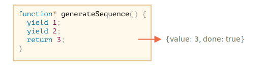

# Generatory

Zwykłe funkcje zwracają tylko jedną, pojedyńczą wartość (lub nie zwracają nic).

Generatory mogą zwrócić wiele wartości, być może ich nieskończoną ilość, jedna po drugiej, na żądanie. Świetnie działają z obiektami typu [iterowalnego](info:iterable), pozwalają na proste tworzenie strumieni danych.

## Funkcje generujące

Aby stworzyć generator, używamy specjalnej składni: `function*`, jest to tak zwana "funkcja generująca".

Wygląda to tak:

```js
function* generateSequence() {
  yield 1;
  yield 2;
  return 3;
}
```

Funkcja `generateSequence()` nie wykonuje kodu, tylko zwraca specjalny obiekt, zwany "generatorem".

```js run
function* generateSequence() {
  yield 1;
  yield 2;
  return 3;
}

// "funkcja generująca" tworzy "generator"
let generator = generateSequence();
*!*
alert(generator); // [object Generator]
*/!*
```


Obiekt typu `generator` można rozumieć jako "zawieszone wywołanie funkcji". Po stworzeniu generatora, wykonanie kodu jest zapauzowane na samym początku:


Główną metodą generatora jest `next()`. Wywołana, wznawia wykonanie aż do następnego polecenia typu `yield <wartość>` (`wartość` może być pominięta, ale będzie jako `undefined`). Wtedy wykonanie zostaje zatrzymane, a `wartość` zostaje zwrócona na zewnątrz.

Wynikiem `next()` jest zawsze obiekt o dwóch włąsciwościach:
- `value`: otrzymana wartość.
- `done`: `true` jeśli kod funkcji się zakończył wykonywać, w przeciwnym wypadku `false`.

Na przyklad, tu tworzymy generator i dostajemy jego pierwszą otrzymaną wartość.
```js run
function* generateSequence() {
  yield 1;
  yield 2;
  return 3;
}

let generator = generateSequence();

*!*
let one = generator.next();
*/!*

alert(JSON.stringify(one)); // {value: 1, done: false}
```


Jak na razie, dostajemy tylko pierwszą wartość, a wykonanie funkcji znajduje się w drugiej linii:


Wywołajmy `generator.next()` ponownie. Metoda wznawia wykonanie i zwraca następny `yield`:

```js
let two = generator.next();

alert(JSON.stringify(two)); // {value: 2, done: false}
```


Jeśli wywołamy ją po raz trzeci, wykonanie zostanie wznowione aż do następnego polecenia `return`, które to kończy funkcje:

```js
let three = generator.next();

alert(JSON.stringify(three)); // {value: 3, *!*done: true*/!*}
```



Praca generatora dobiegła końca. Potwierdza to ostatni rezultat: `{ done: true, value: 3}`.

Nowe wywołania `generator.next()` nie mają sensu. Jeśli je zrobimy, zwrócą ten sam obiekt: `{ done: true}`.

```smart header="`function* f(…)` czy`function *f(…)`?". 
Co kto lubi, obie składnie są poprawne.

Mimo to, w większości przypadków używamy pierwszej składni, ponieważ gwiazdka `*` wskazuje, że to funkcja generująca, tzn. opisuje rodzaj funkcji a nie jej nazwę, więc powinna być obok słowa `function`. 
```

## Na generatorach można dokonywać iteracji.

Jak wskazuje metoda `next()`, generatory to obiekty typu [iterowalnego](info: iterable)

Możemy przechodzić po ich wartościach, za pomocą pętli `for..of`:

```js run
function* generateSequence() {
  yield 1;
  yield 2;
  return 3;
}

let generator = generateSequence();

for(let value of generator) {
  alert(value); // 1, następnie 2
}
```

Jest to znacznie ładniejszy sposób na używanie generatorów, niż korzystanie z `.next().value`, prawda?

...Weź proszę pod uwagę: przykład wyżej pokazuje `1`, następnie `2` i to wszystko. Nie pokazuje `3`!

Jest tak dlatego, ponieważ pętla `for..of` ignoruje ostatnią wartość `value`, jeżeli `done: true`. Jeśli chcemy pokazać wszystkie rezultaty za pomocą pętli `for..of`, to musimy je zwrócić za pomocą `yield`:

```js run
function* generateSequence() {
  yield 1;
  yield 2;
*!*
  yield 3;
*/!*
}

let generator = generateSequence();

for(let value of generator) {
  alert(value); // 1, następnie 2, następnie 3
}
```

Oczywiście, generatory to obiekty typu iterowalnego, więc można też wywoływać na nich funkcjonalności powiązane z iteracją, np. składnie rozwinięcia `...`:

```js run
function* generateSequence() {
  yield 1;
  yield 2;
  yield 3;
}

let sequence = [0, ...generateSequence()];

alert(sequence); // 0, 1, 2, 3
```

W kodzie powyżej, `...generateSequence()` zamienia iterowalny obiekt generatora w tablice wartości (przeczytaj więcej o składni rozwinięcia w rozdziale [parametr rest i składnia rozwinięcia](info:rest-parameters-spread-operator#spread-operator))

## Używanie generatorów do iteracji

Jakiś czas temu w rozdziale [Iteracja](info:iterable) stworzyliśmy obiekt `range` typu iterowalnego, który zwraca wartości `od..do`.

Dla przypomnienia, kod:

```js run
let range = {
  from: 1,
  to: 5,
  
  //for...of range wywołuje tę metodę raz na samym początku
  [Symbol.iterator]() {
    // zwraca obiekt iteratora
    // następnie, for..of działa tylko dla tego obiektu, pyta go o następną wartość
    return {
      current: this.from,
      last: this.to,

      // next() jest wywoływana w każdej kolejnej iteracji przez pętle for..of
      next() {
        // to powinno zwrócić wartość jako obiekt {done:..., value:...}
        if (this.current <= this.last) {
          return { done: false, value: this.current++ };
        } else {
          return { done: true };
        }
      }
    };
  }
};

// iteracja po obiekcie range zwraca liczby od range.from do range.to
alert([...range]); // 1,2,3,4,5
```

Możemy użyć funkcji generatora do iteracji, podając ją jako `Symbol.iterator`:

Tutaj mamy ten sam obiekt `range`, ale znacznie bardziej elegancki:

```js run
let range = {
  from: 1,
  to: 5,

  *[Symbol.iterator]() { // skrócona wersja zapisu: [Symbol.iterator]: function*()
    for(let value = this.from; value <= this.to; value++) {
      yield value;
    }
  }
};

alert( [...range] ); // 1,2,3,4,5
```

To działa, ponieważ `range[Symbol.iterator]` zwraca teraz generator, a metody generatora są dokładnie tym, czego oczekuje `for..of`:
- zawiera metodę `.next()` (tak jak generator)
- która zwraca wartości w formie `{ value: ..., done:true/false}` (tak samo jak generator).

Oczywiście to nie przypadek. Generatory zostały dodane do języka JavaScript z myślą o iteratorach, aby można je było łatwo zaimplementować.

Wariant z generatorem jest znacznie bardziej zwięzły niż oryginalny kod `range` i zawiera te same funkcjonalności.

```smart header="Generatory mogą działać bez końca"
W przykładach powyżej wygenerowaliśmy skończone ciągi, ale możemy też stworzyć generator, który zwraca wartości bez końca. Na przykład, niekończący się ciąg pseudo-losowych liczb.

Wymagałoby to użycia `break` (lub `return`) w `for..of`, w przeciwnym wypadku pętla powtarzałaby sie bez końca.

```

## Kompozycja generatora

Kompozycja generatora to specjalna cecha generatorów, która pozwala transparentnie "osadzić" generator w innym generatorze.

Na przykład mamy funkcję, która generuje ciąg liczb:

```js
function* generateSequence(start, end) {
  for (let i = start; i <= end; i++) yield i;
}
```

Teraz chcielibyśmy użyć jej ponownie do wygenerowania bardziej złożonej sekwencji:
- zaczynająć od cyfr `0..9` (kody znaków 48..57)
- kontynuując po nich wielkich literach alfabetu `A..Z` (kody znaków 65..90)
- i kończąc na małych literach alfabetu `a..z` (kody znaków 97..122)

Następnie, mamy zamiar wytwarzać hasła przez wybieranie znaków z tego ciągu, ale najpierw musimy wygenerować ciąg.

W zwykłej funkcji, aby połączyć ze sobą rezultaty kilku różnych funkcji, wywołujemy je, przechowujemy rezultaty, a na końcu łączymy je ze sobą.

W przypadku generatorów istnieje specjalna składnia `yield*` do "osadzenia" (skomponowania) jednego generatora w drugim.

Skomponowany generator:

```js run
function* generateSequence(start, end) {
  for (let i = start; i <= end; i++) yield i;
}

function* generatePasswordCodes() {

*!*
  // 0..9
  yield* generateSequence(48, 57);

  // A..Z
  yield* generateSequence(65, 90);

  // a..z
  yield* generateSequence(97, 122);
*/!*

}

let str = '';

for(let code of generatePasswordCodes()) {
  str += String.fromCharCode(code);
}

alert(str); // 0..9A..Za..z
```

Dyrektywa `yield*` jest odpowiedzialna za kompozycję. *Deleguje* ona wykonanie do następnego generatora. Mówiąc prościej, dyrektywa uruchamia generatory i transparentnie przekazuje ich "yieldy" na zewnątrz, tak jakby zostały wykonane przez wywołany generator.

Rezultat jest taki sam, jak gdybyśmy wstawili kod w zagnieżdżone generatory:

```js run
function* generateSequence(start, end) {
  for (let i = start; i <= end; i++) yield i;
}

function* generateAlphaNum() {

*!*
  // yield* generateSequence(48, 57);
  for (let i = 48; i <= 57; i++) yield i;

  // yield* generateSequence(65, 90);
  for (let i = 65; i <= 90; i++) yield i;

  // yield* generateSequence(97, 122);
  for (let i = 97; i <= 122; i++) yield i;
*/!*

}

let str = '';

for(let code of generateAlphaNum()) {
  str += String.fromCharCode(code);
}

alert(str); // 0..9A..Za..z
```

Kompozycja generatora to naturalny sposób na przekierowanie strumienia jednego generatora w inny generator. Nie wymaga dodatkowej pamięci do przechowywania pośrednich rezultatów.

## "yield" to droga dwukierunkowa

Do tego momentu, traktowaliśmy generatory jako "iteratory na sterydach". I tak właśnie się z nich często korzysta. Ale tak naprawdę są one znacznie bardziej potężne i elastyczne.

To dlatego, ponieważ `yield` jest drogą dwukierunkową: nie tylko zwraca rezultaty na zewnątrz, ale może też przekazać wartość do środka generatora.

Aby to zrobić, powinniśmy wywołać `generator.next(arg)`, z argumentem. Ten argument jest rezultatem `yield`.

Oto przykład:

```js run
function* gen() {
*!*
  // Przekaż pytanie na zewnątrz i czekaj na odpowiedź. 
  let result = yield "2 + 2 = ?"; // (*)
*/!*

  alert(result);
}

let generator = gen();

let question = generator.next().value; // <-- yield zwraca wartość

generator.next(4); // --> przekazuje rezultat do generatora 
```


1. Pierwsze wywołanie `generator.next()` powinno być zawsze wykonane bez argumentu (argument jest ignorowany, jeśli zostanie przekazany). Rozpoczyna ono wykonanie i zwraca rezultat pierwszego `yield` ("2+2 = ?"). W tym momencie generator zatrzymuje wykonanie, pozostając na linii `(*)`.
2. Następnie, jak pokazane na powyższym obrazku, rezultat `yield` zostaje przypisany zmiennej `question` w wywoływanym kodzie.
3. Poprzez `generator.next(4)`, generator wznawia wykonanie, i `4` zostaje przypisane zmiennej result: `let result = 4`.

Zauważ proszę, kod zewnętrzny nie musi od razu wywołać `next(4)`. Wyliczenie wartości może zająć troche czasu. To też jest prawidłowy kod:

```js 
// kontynuuj działanie generatora po pewnym czasie
setTimeout(() => generator.next(4), 1000);
```

Jak widać, w przeciwieństwie do zwykłych funkcji, generator i kod wywołujący mogą wymieniać wyniki, przekazując wartości w `next/yield`.

Aby uczynić sprawy bardziej oczywistymi, oto inny przykład, z większą ilością wywołań: 

```js run
function* gen() {
  let ask1 = yield "2 + 2 = ?";

  alert(ask1); // 4

  let ask2 = yield "3 * 3 = ?"

  alert(ask2); // 9
}

let generator = gen();

alert( generator.next().value ); // "2 + 2 = ?"

alert( generator.next(4).value ); // "3 * 3 = ?"

alert( generator.next(9).done ); // true
```

Przebieg wykonania:


1. Pierwsze `.next()` rozpoczyna wykonanie... Dochodzi do pierwszego `yield`.
2. Rezultat zostaje przekazany do kodu zewnętrznego.
3. Drugi `.next(4)` przekazuje `4` z powrotem do generatora jako rezultat pierwszego `yield`, a następnie kontynuuje wykonanie.
4. ...Wykonanie dochodzi do drugiego `yield`, ten staje sie rezultatem wywołania generatora.
5. Trzeci `next(9)` przekazuje `9` do generatora, jako rezultat drugiego `yield`, następnie kontynuuje wykonywanie, które dochodzi do końca funkcji, a więc `done: true`.

To przypomina gre w "ping-pong". Każdy `next(value)` (za wyjątkiem pierwszego) przekazuje wartość do generatora, która staje sie rezultatem aktualnego `yield`, a następnie przekazuje rezultat następnego `yield`.

## generator.throw

Jak zauważyliśmy w przykładach wyżej, kod zewnętrzny może przekazać wartość do generatora, jako rezultat `yield`.

...Ale może też zainicjować (rzucić) błąd. Jest to naturalne, ponieważ błąd też jest rodzajem rezultatu. 

Aby przekazać błąd do `yield`, powinniśmy wywołać `generator.throw(err)`. W tym przypadku, `err` jest rzucony w linijce razem z danym `yield`.

Na przykład, poniższy `yield "2 + 2 = ?"` prowadzi do błędu:

```js run
function* gen() {
  try {
    let result = yield "2 + 2 = ?"; // (1)

    alert("Wykonanie nie dosięga tej linii, z uwagi na wyjątek rzucony wyżej");
  } catch(e) {
    alert(e); // pokazuje błąd
  }
}

let generator = gen();

let question = generator.next().value;

*!*
generator.throw(new Error("Odpowiedź nie znaleziona w bazie danych.")); // (2)
*/!*
```

Błąd, rzucony do generatora w linii `(2)` prowadzi do wyjątku w linii `(1)` z `yield`. W przykładzie powyżej, `try..catch` łapie błąd i pokazuje go. 

Jeśli nie złapiemy go, to tak samo, jak w przypadku każdego innego wyjątku, "wyrzuca" generator do kodu wywołującego.

Aktualna linia wywołującego kodu to linia z `generator.throw`, oznaczona jako `(2)`. Możemy więc złapać wyjątek, tak jak w przykładzie poniżej:

```js run
function* generate() {
  let result = yield "2 + 2 = ?"; // Błąd w tej linii.
}

let generator = generate();

let question = generator.next().value;

*!*
try {
  generator.throw(new Error("Nie ma odpowiedzi w bazie danych"));
} catch(e) {
  alert(e); // pokazuje błąd
}
*/!*
```

Jeżeli nie złapiemy tam błędu, to tak jak zwykle, "spada" do zewnętrznego kodu, i jeżeli tam niezłapany, zabija nasz skrypt. 

## Podsumowanie
    
  -  Generatory są tworzone przez funkcje generujące `function* f(...) {...}`.
  -  Tylko w ciele generatorów może istnieć operator `yield`.
  -  Generator i kod zewnętrzny mogą wymieniać pomiędzy rezultaty, za pomocą wywołań `next/yield`.

We wspólczesnym języku JavaScript, generatory są rzadko używane. Czasami jednak mogą się przydać, ponieważ umiejętność wymiany danych pomiędzy funkcją a kodem zewnętrznym podczas wykonania jest dość unikalna. I z pewnością świetnie nadają się do tworzenia obiektów iterowalnych.

Poza tym, w następnym rozdziale, będziemy się uczyć o asynchronicznych generatorach, które są używane do czytania strumieni asynchronicznie wygenerowanych danych w pętlach `for await ... of`.

W programowaniu webowym, często pracujemy z danymi strumieniowymi, więc jest to kolejny bardzo ważny przypadek użycia.
