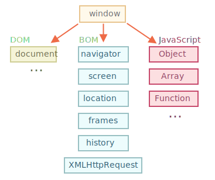

# Środowisko przeglądarki, specyfikacje

Język JavaScript był pierwotnie stworzony na przeglądarki internetowe. Od jego stworzenia ewoluował on i stał się językiem o wielu zastosowaniach i platformach.

Platformą może być przeglądarka, serwer WWW, inny host albo nawet ekspres do kawy. Każdy z nich posiada specyficzną dla siebie funkcjonalność. W nomenklaturze JavaScript nazywamy to *środowiskiem hosta*.

Środowisko hosta wprowadza swoje własne obiekty i funkcje dodatkowe, do języka programowania. Na przykład przeglądarki internetowe umożliwiają kontrolę nad stronami internetowymi, Node.js wprowadza nowe funkcjonalności po stronie serwera i tak dalej.

Poniżej został przedstawiony widok z lotu ptaka na to co się dzieje kiedy JavaScript działa w przeglądarce internetowej.



Istnieje obiekt "root" (po polsku "główny") o nazwie `window`. Ma on dwie role:

1. Jest to obiekt globalny, tak jak to opisano w rozdziale <info:global-object>.
2. Obiekt ten reprezentuje "okno przeglądarki" i zapewnia narzędzia do kontrolowania nim.

Dla przykładu, poniżej używamy tego obiektu jako globalnego:

```js run
function sayHi() {
  alert("Hello");
}

// funkcje globalne są metodami obiektu globalnego:
window.sayHi();
```

A tutaj używamy go jako okna przeglądaraki w celu zobaczenia wysokośi okna:

```js run
alert(window.innerHeight); // wewnętrzna wysokość okna
```

Jest znacznie więcej metod i właściwości dla okien, ale nimi zajmiemy się później.

## DOM (Document Object Model)

Obiektowy model dokumentu (z ang. Document Object Model) w skrócie DOM, reprezentuje zawartość całej strony, która może zostać zmodyfikowana.

`Dokument` (który jest obiektem) jest głównym "punktem wejścia" na stronę. Możemy za jego pomocą stworzyć lub zmodyfikować całą stronę.

Dla przykładu:
```js run
// zmienia kolor tła na czerwony
document.body.style.background = "red";

// zmienia go spowrotme po sekundzie
setTimeout(() => document.body.style.background = "", 1000);
```

W przykładzie poniżej używamy `document.body.style` ale metod modyfikacji jest o wiele więcej. Właściwości i metody zostały opisane w specyfikacji:

- **DOM Living Standard** dostępnym pod adresem <https://dom.spec.whatwg.org>

```smart header="DOM is not only for browsers"
Specyfikacja DOM tłumaczy strukturę dokumentu i zapewnia narzędzia do manipulowania nim. Istnieją też inne narzędzia, inne niż przeglądarki, które również używają DOM.

Dla przykładu skrypty po stronie serwera, które ściągają strony HTML i przetwarzają je, również używają DOM. Mogą one jednak obsługiwać tylko część specyfikacji.
```

```smart header="CSSOM for styling"
Zasady CSS i arkusze stylów mają strukturę inną niż HTML. Dla nich jest inna specyfikacja, która wyjąsnia, w jaki sposób są one przedstawiane jako obiekty i jak je zapisać i wczytać. Jest ona dostępna pod adresem [CSS Object Model (CSSOM)](https://www.w3.org/TR/cssom-1/).

CSSOM jest używany razem z DOM kiedy modyfikujemy reguły stylu dla dokumentu. W praktyce jednak CSSOM jest bardzo rzadko używany, ponieważ zasady CSS są statyczne. Bardzo rzadko zdarza się, że trzeba nam usunąć lub dodać zasady CSS z JavaScriptu.
```

## BOM (Browser Object Model)

Model obiektowy przeglądarki (z ang. Browser Object Model) w skrócie BOM, reprezentuje dodatkowe obiekty dostarczane przez przeglądarkę (środowisko hosta) do pracy ze wszystkim oprócz dokumentu.

Dla przykładu:

- Objekt [navigator](mdn:api/Window/navigator) dostarcza podstawowych informacji o przeglądarce i systemie operacyjnym. Istnieje wiele właściwości, ale dwie najbardziej znane to: `navigator.userAgent` -- o obecnej przeglądarce oraz `navigator.platform` -- o platformie (może pomóc w rozpoznaniu między Windows/Linux/Mac itp.)
- Obiekt [location](mdn:api/Window/location) pozwala nam odczytać aktualny adres URL i może przekierwoać przeglądarkę na nowy.

Oto jak możemy wykorzystać obiekt `location`

```js run
alert(location.href); // pokazuje aktualny URL
if (confirm("Go to Wikipedia?")) {
  location.href = "https://wikipedia.org"; // przekierowuje przeglądarkę do innego adresu URL
}
```

Funkcje `alert/confirm/prompt` również są częścią BOM. Nie są one bezpośrednio powiązane z dokumentem, ale reprezentują metody komunikacji przeglądarki z użytkownikiem.

```smart header="Specifications"
BOM jest częścią ogólnej [specyfikacji HTML](https://html.spec.whatwg.org).

Tak dobrze usłyszałeś. Specyfikacje HTML dostępne pod adresme <https://html.spec.whatwg.org> nie są tylko o języku HTML (tagi, atrybuty) ale także omawiają obiekty, metody i rozszerzenia DOM właściwych dla przeglądarki. To jest „HTML w ogólnych zarysach”. Ponadto niektóre części mają dodatkowe specyfikacje wymienione na stronie  <https://spec.whatwg.org>.
```

## Podsumowanie

Jeżli chodzi o standardy, to mamy:

Specyfikację DOM
: która mówi o strukturze dokumentu, manipulowaniu nim oraz zdarzenia. Zobacz: <https://dom.spec.whatwg.org>.

Specyfikację CSSOM
: która opisuje arkusze stylów, reguły stylów, manipulacje nimi i ich wiązanie z dokumentem. Zobacz: <https://www.w3.org/TR/cssom-1/>.

Specyfikację HTML
: która opisuje język HTML (np. tagi), a także BOM (model obiektowy przeglądarki) -- różne funkcje przeglądarki: `setTimeout`, `alert`, `location` itd. Zobacz https://html.spec.whatwg.org. Wykorzystuje specyfikację DOM i rozszerza ją o wiele dodatkowych właściwości i metod. 

Dodatkowo niektóre klasy są opisane oddzielnie na <https://spec.whatwg.org/>.

Weź pod uwagę te linki, ponieważ jest tak wiele do nauczenia się i zapamiętania, że nie sposób omówić i zapamiętać wszystko.

Jeśli zechcesz przeczytać o jakiejś właściwości lub metodzie, skorzystaj z podręcznika Mozilli pod adresem https://developer.mozilla.org/en-US/search który jest również dobrym źródłem informacji, ale właściwa specyfikacja może okazać się lepsza, ponieważ jest bardziej złożona i dłuższa, ale sprawi, że twoja podstawowa wiedza będzie solidna i kompletna.

Aby coś znaleźć, często wygodnie jest skorzystać z wyszukiwarki internetowej i wpisać "WHATWG [szukany termin]" albo "MDN [szukany termin]", np. https://google.com?q=whatwg+localstorage, https://google.com?q=mdn+localstorage.

Teraz przejdziemy do nauki DOM, ponieważ dokument odgrywa kluczową rolę w interfejsie użytkownika.
